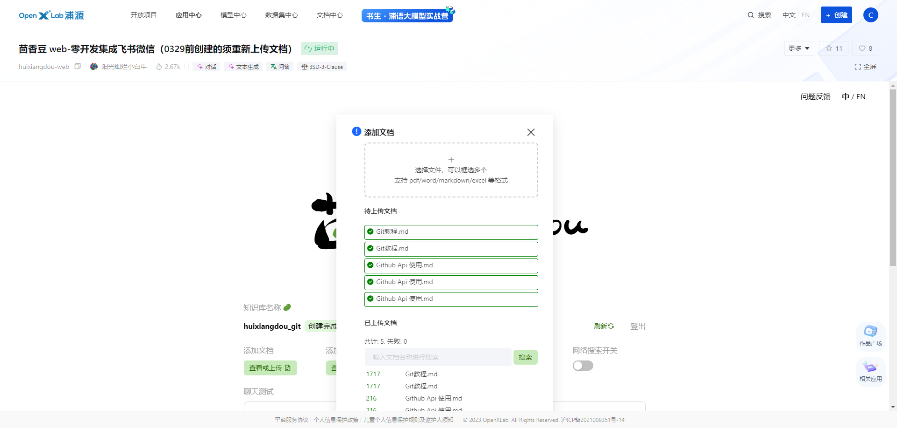

## Homework 3

教程：https://github.com/InternLM/Tutorial/tree/camp2/huixiangdou

作业：https://github.com/InternLM/Tutorial/blob/camp2/huixiangdou/homework.md

#### 1. 在[茴香豆 Web 版](https://openxlab.org.cn/apps/detail/tpoisonooo/huixiangdou-web)中创建自己领域的知识问答助手

上传文件

提问一：什么是git

提问二：怎么使用git

提问三：如何初始化本地仓库

提问四：如何从本地仓库传文件到远程仓库

提问五：上面提问了几个问题

本意想提问用户输入了几个问题；模型返回的是文档中有几个主要方面的内容；

提问六：从识别出的7个主要的话题中，列出每个话题下的几个问题大纲

#### 2.在 `InternLM Studio` 上部署茴香豆技术助手

- 根据教程文档搭建 `茴香豆技术助手`，针对问题"茴香豆怎么部署到微信群？"进行提问

茴香豆进阶

加入网络搜索

使用远程模型

